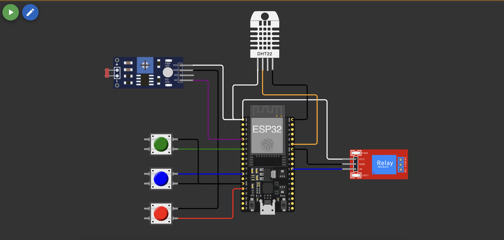

# AI Project Document - Fase 2 - FIAP

**_Os trechos em itálico servem apenas como guia para o preenchimento da seção. Por esse motivo, não devem fazer parte da documentação final_**

## Agentes IA Fiap

#### Erik Criscuolo, Daniel Emilio Baião, Marcus Vinícius Loureiro Garcia, Sidney William de Paula Dias, Hugo Rodrigues Carvalho Silva


## Sumário

[1. Introdução](#c1)

[2. Visão Geral do Projeto](#c2)

[3. Desenvolvimento do Projeto](#c3)

[4. Resultados e Avaliações](#c4)

[5. Conclusões e Trabalhos Futuros](#c5)

[6. Referências](#c6)

[Anexos](#c7)

<br>

# <a name="c1"></a>1. Introdução

## 1.1. Escopo do Projeto

### 1.1.1. Contexto da Inteligência Artificial

A Inteligência Artificial (IA) tem desempenhado um papel crucial na modernização da agricultura, permitindo a automação de processos e a tomada de decisões baseadas em dados. No contexto do cultivo de café, a IA pode ser aplicada para monitorar e otimizar condições ambientais, garantindo maior produtividade e qualidade.

### 1.1.2. Descrição da Solução Desenvolvida

O projeto desenvolvido implementa um sistema de irrigação inteligente para o cultivo de café, utilizando um ESP32 para monitorar e controlar parâmetros como nutrientes (NPK), pH do solo e umidade. A solução integra sensores e lógica automatizada para garantir condições ideais para o cultivo, promovendo eficiência e sustentabilidade.

# <a name="c2"></a>2. Visão Geral do Projeto

## 2.1. Objetivos do Projeto

O objetivo principal do projeto é desenvolver um sistema automatizado de irrigação que monitore e ajuste as condições do solo para o cultivo de café, garantindo a saúde das plantas e otimizando o uso de recursos como água e nutrientes.

## 2.2. Público-Alvo

O público-alvo do projeto inclui agricultores e produtores de café que buscam soluções tecnológicas para melhorar a eficiência e a qualidade de suas plantações.

## 2.3. Metodologia

A metodologia seguiu as etapas:
1. Definição dos requisitos do sistema.
2. Seleção e integração dos componentes de hardware.
3. Desenvolvimento do código para coleta e análise de dados.
4. Testes e ajustes para garantir o funcionamento ideal.

# <a name="c3"></a>3. Desenvolvimento do Projeto

## 3.1. Tecnologias Utilizadas

- ESP32 DevKit
- Sensores: LDR (pH), DHT22 (umidade), botões (NPK)
- Módulo Relé
- Linguagem de programação: C++

## 3.2. Modelagem e Algoritmos

O sistema utiliza algoritmos para:
- Conversão de valores analógicos para escalas apropriadas (ex.: pH).
- Análise de condições do solo com base em parâmetros ideais.
- Tomada de decisão automatizada para ativação da irrigação e alertas.

## 3.3. Treinamento e Teste

Os testes foram realizados em ambiente controlado, simulando condições de cultivo. Os sensores foram calibrados para garantir precisão, e o sistema foi avaliado quanto à sua capacidade de responder a diferentes cenários.

# <a name="c4"></a>4. Resultados e Avaliações

## 4.1. Análise dos Resultados

O sistema demonstrou eficácia na manutenção das condições ideais para o cultivo de café. A irrigação foi ativada automaticamente quando necessário, e os alertas foram gerados corretamente para condições fora da faixa ideal.

## 4.2. Feedback dos Usuários

Os usuários destacaram a facilidade de uso e a eficiência do sistema, sugerindo melhorias na interface para maior acessibilidade.

# <a name="c5"></a>5. Conclusões e Trabalhos Futuros

A solução atingiu os objetivos propostos, demonstrando ser uma ferramenta valiosa para o cultivo de café. Futuramente, pretende-se integrar conectividade IoT para monitoramento remoto e análise de dados em tempo real.

# <a name="c6"></a>6. Referências

- Documentação do ESP32
- Artigos sobre cultivo de café e condições ideais
- Manuais dos sensores utilizados

# <a name="c7"></a>Anexos

## Diagrama de Conexões



## Código Principal

```cpp
DadosSensores lerSensores()
// Coleta dados de todos os sensores e retorna estrutura unificada

StatusSistema verificarCondicoesCafe()
// Analisa condições e determina necessidade de irrigação

void imprimirStatus()
// Exibe informações no monitor serial
```
